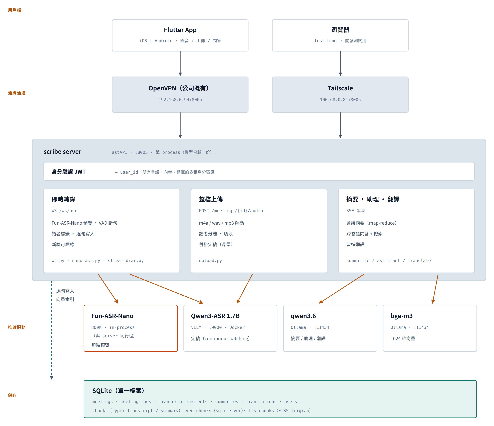
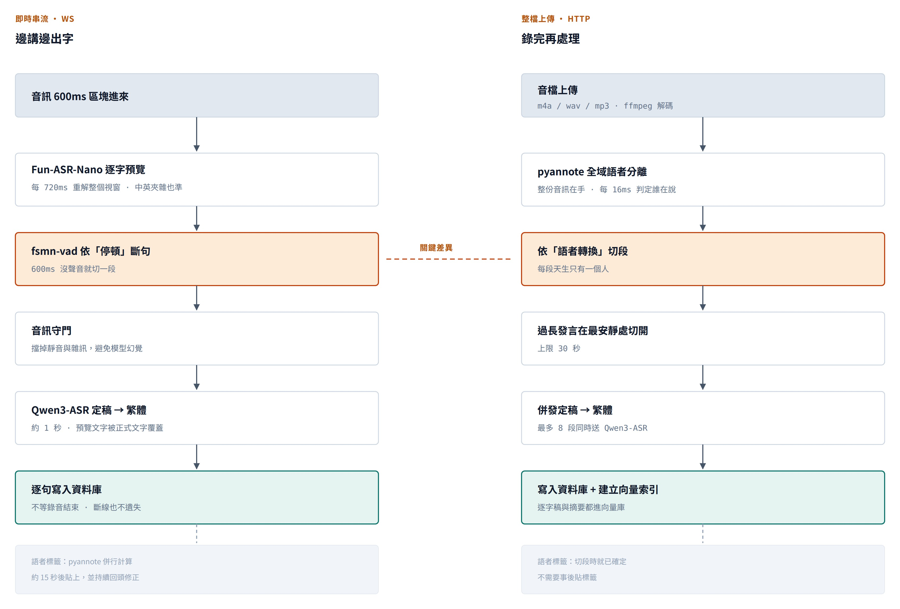
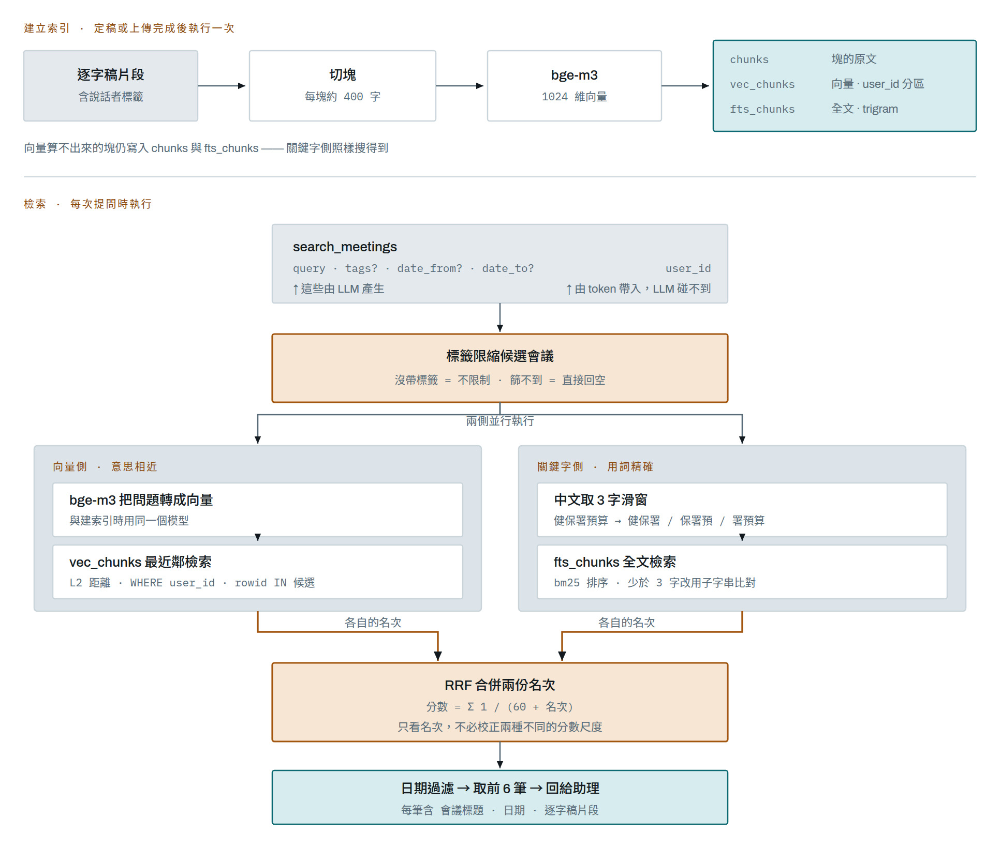

# scribe — 語音會議助理（Server 端）

即時把會議錄音轉成**逐字稿**（邊講邊出字）、句子結束自動**定稿**（高準），並且能實現語者分群 和 會議摘要，
也可針對該場會議**問答**。目標是一個個人助理 app 的後端；本 repo 是 server 端。

> 📱 手機 App（iOS/Android 客戶端）：[**scribe-app**](https://github.com/VictorFu0717/scribe-app)
>
> 目錄名目前仍是 `websocket_ASR`，專案代稱為 **scribe**。

---

## 架構



四層：用戶端 → 連線通道 → 應用伺服器 → 推論服務與儲存。對外只有 `:8005` 一個入口，
定稿與對話模型都在同一台機器的其他埠上、不對外開放。

**為什麼這樣切**：Qwen3-ASR 的「串流」API 不支援 batch、無法併發；因此
- **即時預覽**用 Fun-ASR-Nano（本地、in-process vLLM，中英夾雜也準）；
  想省 GPU 可切回輕量的 paraformer-streaming（`STREAM_BACKEND=paraformer`，見「即時預覽後端」）；
- **定稿**丟給 `vllm serve` 的 Qwen3-ASR，vLLM 做 continuous batching → **真併發**。

### 併發模型（為什麼 `workers=1` 仍能同時服務多人）

`workers=1` 指的是「**單一 process、模型只載一份**」，**不是**一次只能處理一個請求：

- 單一 **async event loop** 可同時 juggle 多條 WebSocket 連線（每條各自維護狀態）。
- 逐字預覽 / VAD 是本地小模型呼叫，以一把鎖序列化，但每次 ~毫秒級，不是瓶頸。
- **定稿**是 async 打到 vLLM → vLLM 做 **continuous batching**，跨所有連線**真併發**。

開更多 worker 反而**有害**：每個 worker 會各載一份 FunASR 模型、VRAM 翻倍；GPU 才是瓶頸，
不是 web 層。要再擴充併發是加大 vLLM（或多卡 / 多 vLLM 實例），不是加 uvicorn worker。

---

## 元件與埠

| 服務 | 說明 | 埠 (host) | 啟動方式 |
|------|------|:---:|----------|
| **scribe** | 本 server（ASR + SQLite 儲存 + 會議 CRUD + QA）| 8005 | `python main.py` |
| **Qwen3-ASR** | 定稿 vLLM 服務（音訊→文字，Ollama 做不了）| 9000 | `docker/`（本 repo）|
| **對話 LLM** | 摘要/QA/助理；Qwen3.6-27B(vLLM) **或** Ollama `qwen3.6` | 8004 / 11434 | vLLM 或 `ollama serve` |

### 專案結構

```
main.py                    精簡入口(組裝 app、lifespan、掛路由)
app/
├── config.py              所有設定(env)
├── models.py              本地 ASR/語者模型 + OpenCC + 定稿呼叫 + 音訊守門
├── db.py                  SQLite(meetings/transcripts/summaries/chunks/vec/fts/users)
├── ws.py                  /ws/asr 即時轉錄 + 說話者 + 逐句寫入
├── upload.py              整檔上傳轉錄(背景批次)
├── diarize.py             語者分群(線上/離線)+ A2 切段規則
├── pyannote_diar.py       pyannote 語者分離(選用,失敗自動退回 campplus)
├── stream_diar.py         串流語者分離(邊錄邊算)
├── llm.py                 對話 LLM 存取層(vLLM / Ollama 雙後端)
├── embed.py               ⑥ embedding client(含 NaN 防護)
├── rag.py                 ⑥ 切塊/索引/檢索(向量 + 可選 hybrid)
├── summarize.py           ④ 會議摘要(SSE)
├── assistant.py           ⑤ agentic 助理(SSE + 工具)
├── translate.py           留檔翻譯(SSE)
├── chat_qa.py             /meeting/chat 單場問答(舊端點)
├── auth.py                ⑦ JWT / Tailscale 身分
└── routers/meetings.py    會議 CRUD + 標籤 + reindex
docs/                      架構圖(README 內嵌)
```

---

## 部署與連線（兩條路徑任選 + JWT）

App／使用者有**兩種方式**連到 server，兩條都可用、可並存：

| 方式 | 連線位址 | 適用 | 備註 |
|------|---------|------|------|
| **OpenVPN**（公司既有）| `http://192.168.0.94:8005` | 公司同仁（VPN 把設備接進內網）| 沿用現有 VPN 帳號，**無額外人數限制與費用** |
| **Tailscale** | `http://100.68.0.81:8005` | 未納管設備、外部協作 | 免費上限 **6 users**；更多需付費或自架 Headscale |

WS 端點分別是 `ws://192.168.0.94:8005/ws/asr` 與 `ws://100.68.0.81:8005/ws/asr`。

- **為什麼不用公司 WiFi 直連**：WiFi 客戶端（如 `192.168.68.x`）與 server 有線網段（`192.168.0.0/23`）
  **不同網段**，直連要請 MIS 開跨網段路由。OpenVPN 與 Tailscale 都是把設備「接進」可達的網路，
  繞過這個問題，零網管成本。
- **身分一律走 JWT**（`AUTH_MODE=jwt`）：登入拿 token，**與連線層無關** → 同一人今天走 OpenVPN、
  明天走 Tailscale，都是同一個 `user_id`（多租戶資料不會分裂）。
  ⚠️ 這也是**不能用 `AUTH_MODE=tailscale` 的原因** —— `tailscale whois` 認不出 OpenVPN 進來的來源 IP，
  那些人會全部退回 `DEFAULT_USER`、共用同一份資料。兩條路徑並存時只能用 JWT。
- **防火牆**：對外只開 `8005`，且只開給這兩條路徑的來源
  ```bash
  sudo ufw allow in on tailscale0 to any port 8005            # Tailscale
  sudo ufw allow from 192.168.0.0/23 to any port 8005         # 內網(含 OpenVPN 進來的流量)
  ```
  OpenVPN 客戶端若**不是** NAT 成內網位址、而是拿 VPN 位址池的 IP（如 `10.8.0.x`），
  要改成放行那個網段：`sudo ufw allow from 10.8.0.0/24 to any port 8005`。
  用 `sudo tail -f /var/log/ufw.log` 或看 uvicorn log 的來源 IP 就能確認實際是哪一種。
- `9000`(Qwen3-ASR)、`11434`(Ollama) 是內部服務，**不對外開**（Ollama 若要給內網同仁用，只對 LAN 網段開）。

---

## 前置需求

- NVIDIA GPU + driver + [nvidia-container-toolkit](https://docs.nvidia.com/datacenter/cloud-native/container-toolkit/latest/install-guide.html)（Windows 用 Docker Desktop + WSL2）
- Docker / Docker Compose v2
- Python 3.12 + 本 repo 的 `.venv`（已裝 funasr / vllm / qwen-asr / opencc 等）
- **`ffmpeg`（整檔上傳必備）**：`sudo apt install ffmpeg`。手機錄音預設是 **m4a/aac**，
  libsndfile 不支援，只能靠 librosa 的 audioread→ffmpeg 後備解碼。缺了會讓
  `POST /meetings/{id}/audio` 回 **400 cannot decode audio**。
  ⚠️ 光裝 ffmpeg 還不夠：該後備是 spawn `ffmpeg -i <路徑>`，**只吃檔案路徑、吃不了記憶體物件**，
  所以 `upload.py` 的 `_load_audio` 會在記憶體解碼失敗時把上傳內容落地成暫存檔再解。

---

## 啟動流程（三步）

```bash
# 1) 定稿服務:Qwen3-ASR (vLLM)
cd docker && docker compose up -d          # host :9000;首次會 build + 載入模型
docker compose logs -f                      # 等到 "Application startup complete"

# 2) 對話 LLM(擇一)
#    a) vLLM Qwen3.6-27B(另一個 repo):
cd ~/PycharmProjects/RAG_LangChain/vllm && docker compose up -d   # host :8004
#    b) 或用 Ollama(較省事):
ollama serve && ollama pull qwen3.6        # host :11434

# 3) scribe 主服務
cd ~/PycharmProjects/websocket_ASR
.venv/bin/python main.py                                   # 用 vLLM 對話(預設 :8004)
# 若對話用 Ollama(thinking 自動關;keep-alive 常駐避免冷重載):
CHAT_BASE_URL=http://localhost:11434/v1 CHAT_MODEL=qwen3.6:latest CHAT_API_KEY=ollama \
  OLLAMA_KEEP_ALIVE=-1 .venv/bin/python main.py            # :8005

# 測試:瀏覽器開 test.html(錄音→逐字→定稿→問這場會議)
```

---

## 端點

### ① 即時轉錄 — `WS /ws/asr`
```
Client → Server:
  binary                              PCM16 LE mono 16k 音訊
  {"type":"config","diarization":true,"meeting_id":"<id>"}  開/關語者辨識 + 關聯會議(定稿會寫入此 meeting)
  {"type":"end"}                       結束本段,定稿(+寫入儲存)後回 final
  {"type":"reset"}                     丟棄狀態重來
Server → Client (JSON):
  {"type":"partial","committed":..,"tentative":..,"text":..,"diarization":bool,
   "segments":[{"speaker":"說話者1","text":..}, ...]}   committed=已定稿句,tentative=即時灰字
  {"type":"final","text":..,"segments":[...],"meeting_id":..}
  {"type":"config","diarization":bool,"meeting_id":..}   config 回覆
  {"type":"error","detail":..}
```
> **說話者辨識**：可開關、用到才載入（不開＝零 VRAM）。開啟後每句定稿會標上「說話者N」，
> `segments` 提供結構化結果，`committed`/`final.text` 會加「說話者N：」前綴並逐句換行。
>
> 有兩套後端：**CAM++**（每段抽一次聲紋再分群，受限於斷句細緻度 —— 一段混多人就必然失準）
> 與 **pyannote**（幀層級判定，可處理重疊語音）。預設 `auto`：裝了 pyannote 就用它。
> 兩者的實測比較與取捨見下方。
>
> **⚠️ 段落太短時聲紋根本不可用**（實測 CAM++，這是「語者變很多」的根因）：
>
> | 段長 | 同一人 cos（平均/最低）| 不同人 cos | 同一人被判成不同人 |
> |---|---|---|---|
> | 0.3s | 0.18 / −0.14 | 0.07 | **99%** |
> | 1.0s | 0.37 / −0.08 | 0.10 | **80%** |
> | 2.0s | 0.56 / 0.28 | 0.16 | 27% |
> | 3.0s | 0.67 / 0.51 | — | 0% |
>
> 「同語者 cos≈0.67」**只在 3 秒以上成立**。短段的問題不是「兩人分不開」（不同人始終穩定在 0.07~0.16），
> 而是**同一人自己跟自己都對不上**，同人/異人分布完全重疊 → **調門檻救不了**，只能不讓短段產生新語者。
>
> **分群策略**（`app/diarize.py`）：
> - **即時串流** → `SpeakerClusterer.assign(emb, 秒數)` 線上貪婪 + 兩道防護：
>   (A) 短於 `SPK_MIN_NEW_SEC` 的段**只能歸入既有語者、不得新增、也不更新中心**；
>   (B) 每 `SPK_RECLUSTER_EVERY` 段用 `assign_all()` 回頭全域重分群、改寫先前標籤並同步 DB
>   （WS 每次 partial 本就重送整個 `segments`，App 會自動更新；收尾時再強制跑一次）。
> - **整檔上傳** → 同樣走 `assign_all()`：用夠長的段決定分群（centroid linkage），再把每段（含短段）歸到最近的中心。
>
> 
>
> **整檔上傳可改用 pyannote 語者分離**（`DIARIZE_BACKEND`/`DIARIZE_SEGMENT`）。
> 5 場真實會議（AliMeeting，重疊率 2%~64%，含 RTTM 標準答案）實測 DER：
>
> | 切段依據 | 標籤來源 | 平均 DER | 語者人數 |
> |---|---|---|---|
> | VAD（停頓）| campplus（現狀）| 44.1% | 常塌成 1~2 位或碎成 8~9 位 |
> | VAD（停頓）| pyannote（A1）| 37.2% | **每場都對** |
> | **語者轉換（A2）**| pyannote | **20.8%** | **每場都對** |
>
> ⚠️ **不要拿「campplus 44.1% vs pyannote 原始時間軸 16.1%」宣稱改善 24pp** —— 那混淆了
> 「標籤方法」與「輸出顆粒度」。真正的改善要靠 A2 換掉切段依據。
>
> **即時串流的三種組合**（5 場真實會議實測）：
>
> | 組合 | 字的延遲 | 語者 DER | 語者人數 |
> |---|---|---|---|
> | `WS_SEGMENT=vad` + `WS_DIARIZE=campplus` | ~1 秒 | 43.4% | 5 場錯 3 場 |
> | **`vad` + `auto`（預設）**| **~1 秒** | **38.4%** | **每場都對** |
> | `speaker` | ~20 秒 | **21.3%** | 每場都對 |
>
> 如果 App 有「邊聽邊看即時翻譯」的需求，就用預設的 `vad`+`auto`：字的速度完全不變，
> 語者標籤晚約 15 秒貼上並持續修正。**21% 那個品質是延遲換來的** —— 要先知道誰在講才切得了段。
>
> 參數很關鍵（3 場真實會議實測，上傳 A2 基準 DER 12.8%／中位段長 6.3s）：
>
> | 設定 | DER | 中位段長 |
> |---|---|---|
> | `latency=10, recluster=10` | 15.2% | **3.7s**（明顯比上傳碎）|
> | **`latency=15, recluster=5`（預設）**| **13.2%** | **5.3s** |
> | `latency=20, recluster=10` | 13.2% | 5.4s（再拉長沒有更好）|
>
> 代價是定稿慢約 15~20 秒（要等 pyannote 的 10 秒視窗滑過去，再加定案餘裕），
> 但 paraformer 預覽灰字仍即時，畫面不會空著。只吃 4% 即時預算、約 36MB/小時/連線，
> **且不需要保存錄音**（只留聲紋與語音活動圖譜，還原不成可聽的內容）。
> 已知限制：開頭一分鐘分群未穩時可能「該切沒切」（兩人塞進同一段），事後無法補救。
>
> A2 的取捨：段落從「一句話」變成「一段發言」（較長、較少：83 段 → 43 段）；
> 重疊語音只保留主導者；重疊嚴重的場合改善有限（64% 重疊那場僅 64.2%→57.0%）。
> **App 端不需改**（欄位格式不變），但上傳與即時錄音的段落顆粒度會不一致。
>
> 模擬實測（100 次/組，段長分布貼近真實對話）：
>
> | 情境 | 原版貪婪 | 加 (A) | **加 (A)+(B)** |
> |---|---|---|---|
> | 2人/30段 | 74.1%／**11.4 位語者** | 85.4%／2.5 | **100%／2.0** |
> | 3人/40段 | 82.5%／**15.9 位** | 86.2%／3.3 | **98.7%／2.9** |
> | 4人/60段 | 87.3%／**22.7 位** | 88.2%／4.4 | **99.4%／4.0** |
>
> linkage 是實測選出來的：模擬 200 次/組，在同語者 cos≈0.52 的高難度下 centroid 達 **99.5%**、
> 貪婪 94.2%、而 average+cosine 只有 86.8%（**反而輸給貪婪** —— 群一大平均兩兩相似度就被拉低而過度切分，
> 與「比中心」的貪婪語意不匹配）。真實 CAM++ 水準（cos≈0.68）下三者皆 100%，差異只在難分的邊界情況。

### ⑤ agentic 助理 — `POST /assistant/chat`（SSE 串流）
```
body: {"messages":[{"role","content"}...], "meeting_id":str|null, "language":"zh-Hant"}
回傳(text/event-stream): data: {"delta":"..."}  ...  data: [DONE]
```
> 手寫 **agent loop**:LLM 自行決定是否呼叫工具(多輪),最後串流答案。工具:
> `get_meeting_transcript` / `get_meeting_summary` / `list_meetings` / `search_meetings`(**語意檢索**,可帶日期範圍)。
> 帶 `meeting_id` → 以該場為「目前會議」;不帶 → 可跨會議。系統會注入「今天日期」,agent 能自行把
> 「上週/上個月5號」換算成 `date_from/date_to` 傳給 `search_meetings`。工具註冊表好擴充(加工具 = 加 schema + handler)。

### 編輯逐字稿 — `PUT /meetings/{id}/transcript`

App 讓使用者修正辨識錯字、改說話者後整份回存。

```
PUT /meetings/{id}/transcript
{"segments":[{"text":"…","speaker":"說話者1","start_ms":0,"end_ms":5000}, ...]}
→ {"id":..,"segments":N,"status":"saved"}
```
> **整組取代**：沒帶的段落等於刪除，`seq` 依陣列順序重編。
> 可以直接把 `GET .../transcript` 的回傳改一改再送回來（多餘的 `id`/`is_final` 欄位會被忽略）。
>
> - **錄音中不可編輯** → **409**。即時串流正逐句寫入同一張表，同時編輯會互相蓋掉；
>   只允許 `status=ready`／`error`。
> - 存檔後**背景自動重建向量索引**，否則助理問答查到的還是舊文字。
> - 段落文字不可為空 → **400**（要刪就整段不要送）。

### 問答檢索流程



上半是**建立索引**（定稿或上傳完成後跑一次），下半是 `search_meetings` 工具內部**每次提問時**做的事。

- `user_id` 由 token 帶入，**不在 LLM 產生的參數裡** —— 助理無法查到別人的會議。
- 標籤在**向量檢索之前**就限縮候選，不是查完再過濾。
- 圖中的關鍵字側需 `RAG_HYBRID=1` 才啟用；預設走純向量（實測混合檢索與純向量打平，見下方）。
- 索引兩種內容，以 `chunks.type` 區分：**`transcript`**（逐字稿切塊）與 **`summary`**
  （結構化摘要攤平成 概述／重點／決議／待辦／後續）。檢索結果會帶 `type` 讓助理知道來源。
  摘要通常只有幾塊、成本很低，但「哪場會議做了什麼決議」這類問題命中率高很多 ——
  決議句在摘要裡是一句話，在逐字稿裡卻散落在「好啊那我們就這樣」之類的口語中。
- 向量側用的是 **L2 歐氏距離**（sqlite-vec `vec0` 的預設，非 cosine）。bge-m3 回傳單位長度向量，
  此時 `‖a−b‖² = 2(1−cos)`，排序與 cosine 完全等價（已實測驗證）。
  ⚠️ 這是隱性依賴：若 `EMBED_MODEL` 換成**不做正規化**的模型，排序會悄悄變錯且無錯誤訊息 ——
  屆時要在建表時加 `distance_metric=cosine` 並重建索引。

### 會議標籤（讓 RAG 檢索更精準）

使用者自訂標籤（如「專案會議」「每週會議」「AI會議」），**選填、一場可多個**。

```
POST   /meetings              {"title":..,"tags":["專案會議"]}   建立時可帶(選填)
PATCH  /meetings/{id}         {"title":..,"tags":[...]}          更新;沒帶的欄位不動
                                                                 tags 為**整組覆寫**,[] = 清空
GET    /meetings?tags=A,B     逗號分隔;回傳帶有「任一個」該標籤的會議
GET    /meetings/tags         → {"tags":[{"tag":"專案會議","count":3}, ...]}
```
> `GET /meetings`、`GET /meetings/{id}` 的回傳都多一個 **`tags`** 陣列欄位
> （App 不改也不會壞，多的欄位會被忽略）。標籤正規化：去空白、去重（不分大小寫但保留原寫法）、
> 單一標籤 ≤40 字、每場 ≤20 個。刪除會議會連帶清掉標籤。
>
> **助理怎麼用**：使用者的標籤清單會注入 system prompt，agent 判斷問題對應某標籤時
> （如「專案會議談了什麼」）就把它傳給 `search_meetings` 的 `tags` 參數縮小範圍。
>
> ⚠️ 標籤過濾是**在向量檢索當下就限制候選**（sqlite-vec 原生支援 `rowid IN`），
> 不是「先取 top-k 再過濾」—— 後者在「500 場裡只有 3 場帶該標籤」時很可能整個篩空。

### 重建向量索引 — `POST /meetings/{id}/reindex` / `POST /meetings/reindex`

```
POST /meetings/{id}/reindex   → {"id":..,"status":"indexed"}      單場,同步(約 1~2 秒)
POST /meetings/reindex        → {"meetings":N,"status":"reindexing"} 該使用者全部,背景
```
> 什麼時候需要：**embedding 服務曾經掛掉**（那幾場只建了關鍵字索引，純向量模式搜不到，
> log 會有 `[rag] ... 僅建關鍵字索引`）、⑥ RAG 之前就存在的舊會議、或換了 embedding 模型。
> `index_meeting` 冪等，重跑安全。單場若 embedding 服務不可用會回 **503**。

### ③ 單場會議問答（舊）— `POST /meeting/chat`（SSE 串流）
```
body: {"transcript":"逐字稿全文","question":"問題","history":[{"role","content"}...]}
回傳(text/event-stream): data: {"delta":"..."}  ...  data: [DONE]
```
> stateless(client 帶逐字稿)。已由 ⑤ `/assistant/chat` 取代(server 用 meeting_id 自取 + 工具);此端點保留相容。

### 會議 CRUD + 儲存（①②③）
存於 SQLite（`scribe.db`），皆掛 `user_id`（多租戶）。開發期以 `X-User-Id` header 指定使用者（預設 `dev`）。

| 端點 | 說明 |
|------|------|
| `POST /meetings` | 建會議（App 開始錄音時），body `{"title"}` → 回 meeting（`status:"recording"`）|
| `GET /meetings` | 列出使用者的會議 → `{"items":[...]}` |
| `GET /meetings/{id}` | 單一會議 metadata |
| `DELETE /meetings/{id}` | 刪除（連帶逐字稿/摘要）→ 204 |
| `GET /meetings/{id}/transcript` | `{"segments":[{id,text,speaker,is_final,start_ms,end_ms}]}` |
| `GET /meetings/{id}/summary` | 有摘要回 JSON；沒有回 **404** |

> **② 定稿寫入（逐句即時、斷線不丟）**：WS `config` 帶 `meeting_id` 後，**每句定稿就立刻寫入 DB**（不等 `end`）。
> 所以 iOS 背景中斷／WS 斷線也不會丟已定稿的句子；`end` 或斷線收尾時把會議設 `status="ready"` + 更新 `duration_sec` + 建 RAG 索引（不會卡在「轉錄中」）。
> **重連續錄**：用同一 `meeting_id` 重新 `config`，會接在既有段落之後續號（不覆蓋）。

### 整段錄音上傳轉錄 — `POST /meetings/{id}/audio`（背景批次）
```
multipart/form-data: file=<音檔 wav/flac/ogg;mp3/m4a 需 ffmpeg>, diarization=<true|false>
→ {"id":..,"status":"transcribing","duration_sec":N}
```
> 上傳後 server **背景**處理:VAD 切段 → 每段送 Qwen3-ASR 定稿(併發,vLLM batching)→ 可選說話者辨識
> → 寫入該會議。App 上傳後輪詢 `GET /meetings/{id}` 直到 `status="ready"`,再 `GET .../transcript`。
> 過長的 VAD 段會自動切 ≤30s(`UPLOAD_MAX_SEG_SEC`);併發上限 `UPLOAD_CONCURRENCY`(預設 8)。

### ④ 會議摘要 — `POST /meetings/{id}/summarize`（SSE 串流）
```
body: {"language":"zh-Hant"}   (可省略)
回傳(text/event-stream):
  data: {"delta":"..."}            邊產邊顯示的 Markdown 文字
  ...
  data: {"overview":"..","key_points":[..],"decisions":[..],
         "action_items":[{"task","owner?","due?"}],"follow_ups":[..]}   結構化卡片
  data: [DONE]
```
> 先串流 Markdown 供顯示,串完解析成結構化 JSON、存入 DB(之後 `GET .../summary` 可取)。
> 長逐字稿自動 **map-reduce**(分段濃縮再合併)。摘要會存檔並把會議 `has_summary` 設為 true。

### ⑦ 身分辨識（多租戶 user_id 來源）

由 `AUTH_MODE` 決定；**切換只改這一個設定**，RAG / 會議 / 摘要等其他程式完全不用動（都只吃 `get_current_user` 給的 `user_id`）。

> **為什麼預設 `jwt`**：連線有**兩條路徑**（OpenVPN 進內網 `192.168.0.94`、Tailscale `100.x`），
> 而網路層只有 Tailscale 認得出人 —— OpenVPN／LAN 不提供「使用者是誰」。只有**應用層登入**
> 才能讓同一人在兩條路徑上拿到一致身分。帳密登入一次（app 存 token）→ 走哪條網路都認得同一人。
> 此時 VPN（兩者皆是）只負責**連線通道**，不再是身分來源。

**`AUTH_MODE=jwt`（預設；OpenVPN + Tailscale 並存、或對公網）— 帳密登入 → JWT**
```
POST /auth/register  {"username","password"}       → {access_token,token_type,expires_in,user_id,username}
POST /auth/token     form: username=&password=     → 同上(OAuth2 標準)
GET  /auth/me        Authorization: Bearer <jwt>   → 目前使用者
```
- 端點以 `Authorization: Bearer <jwt>` 認身分；WS 可用 `?token=`／`Authorization` header／`config` 訊息帶 `token`。
- `AUTH_REQUIRED=1` 強制 token（否則 401）；`=0`（開發）沒帶退回 `X-User-Id`／`DEFAULT_USER`，且 `/auth/token` 未知帳號自動註冊。
- 帳號管理：目前**開放註冊**（網路層已被 OpenVPN／Tailscale 閘控，外人連不到）；審核制／邀請制待補（register→待審→admin 核准）。

**`AUTH_MODE=tailscale`（選用；**只有**全員走 tailnet 時才適用）— 身分取自 `tailscale whois`**
- 免 app 登入，tailnet 邀請名單即白名單；同一人多裝置＝同一 email＝同一租戶。
- ⚠️ **目前不適用**：OpenVPN／LAN 進來的連線 whois 認不出人，會全部退回 `DEFAULT_USER`
  **共用同一份資料**（多租戶隔離失效）。兩條路徑並存就只能用 `jwt`。

### 留檔翻譯 — `POST /meetings/{id}/translate`（SSE 串流）
```
body: {"target":"en"}    (語言代碼或名稱;en/ja/ko/zh-Hant/vi/…)
回傳(SSE): data: {"delta":"..."}  ...  data: [DONE]
GET /meetings/{id}/translation?target=en  → {"target","text"}   (未翻過回 404)
```
> 把逐字稿用 chat LLM 翻成目標語言、保留每行「說話者N：」逐行結構、串流回傳並**存檔**（可重取）。長逐字稿分段翻。
> **即時雙語字幕請走 app 端「裝置內翻譯」**（google_mlkit_translation / Apple Translation，零延遲、免 server 負載）；
> 此端點是「會後留檔的高品質翻譯」。

### `GET /health`
回傳各模型載入狀態。

---

## 設定（環境變數）

| 變數 | 預設 | 說明 |
|------|------|------|
| `VLLM_BASE_URL` | `http://localhost:9000/v1` | Qwen3-ASR 定稿服務 |
| `QWEN_MODEL` | `Qwen/Qwen3-ASR-1.7B` | 定稿模型名 |
| `CHAT_BASE_URL` | `http://localhost:8004/v1` | 對話 LLM 服務;用 Ollama 設 `http://localhost:11434/v1` |
| `CHAT_MODEL` | `Qwen3.6-27B` | 對話模型名;Ollama 設 `qwen3.6:latest` |
| `CHAT_API_KEY` | `EMPTY` | 對話 LLM 金鑰（Ollama 隨意填如 `ollama`）|
| `CHAT_BACKEND` | `auto` | 對話後端:`auto`(URL 含 `:11434`→ollama,否則 vllm) / `ollama` / `vllm`。決定「關 thinking」與 API 呼叫方式（見下方說明）|
| `CHAT_THINK` | `0` | 是否開 thinking。`0`=關（預設,快;會議任務不需深度推理）、`1`=開 |
| `OLLAMA_KEEP_ALIVE` | `30m` | (ollama 後端) 每次呼叫帶入,模型保留多久;設 `-1`=永久保留（根治 36B 冷重載 ~90s） |
| `SCRIBE_DB` | `scribe.db` | SQLite 資料庫路徑（含 sqlite-vec 向量表）|
| `DEFAULT_USER` | `dev` | 開發期預設 user_id（auth ⑦ 前的多租戶佔位）|
| `EMBED_BASE_URL` | `http://localhost:11434/v1` | Embedding 服務（預設 Ollama）|
| `EMBED_MODEL` | `bge-m3` | Embedding 模型（1024 維）|
| `EMBED_DIM` | `1024` | 向量維度（換模型要一起改）|
| `RAG_CHUNK_CHARS` | `400` | 逐字稿切塊字元數 |
| `RAG_HYBRID` | `0` | `0`=**純向量（預設）**；`1`=向量＋關鍵字 RRF 混合。實測混合未帶來品質提升，見下方 |
| `RAG_RRF_K` | `60` | RRF 常數：`score = Σ 1/(K + 名次)`。越大越像投票、越小越偏袒各自第一名 |
| `TRANSLATE_MAP_CHARS` | `3000` | 留檔翻譯:超過此長度就分段翻 |
| `AUTH_MODE` | `jwt` | 身分來源:`jwt`(帳密登入,預設;OpenVPN+Tailscale 並存時的唯一選擇) 或 `tailscale`(whois,全員走 tailnet 才適用) |
| `AUTH_SECRET` | `dev-insecure...` | JWT 簽章密鑰（`jwt` 模式;**正式務必覆寫**,>=32 bytes）|
| `AUTH_TTL` | `43200` | token 有效秒數（12h）|
| `AUTH_REQUIRED` | `0` | (`jwt` 模式) `1`=強制 Bearer;`0`=沒帶退回 `X-User-Id`/`DEFAULT_USER` |
| `UPLOAD_MAX_SEG_SEC` | `30` | 上傳轉錄:過長 VAD 段的再切秒數 |
| `UPLOAD_CONCURRENCY` | `8` | 上傳轉錄:同時打 Qwen3-ASR 的段數上限 |
| `STREAM_MODEL` / `VAD_MODEL` | `paraformer-zh-streaming` / `fsmn-vad` | 預覽 / 斷句模型 |
| `STREAM_BACKEND` | `nano` | 即時預覽後端：`nano` / `paraformer`（見下節）|
| `NANO_GPU_FRAC` | `0.10` | nano 的 vLLM 顯存配額，**佔總顯存的比例**（96GB 卡 ≈ 9.6GB）|
| `NANO_HOTWORDS` | *(空)* | 熱詞／context biasing，逗號分隔（公司術語、人名、專案代號）|
| `NANO_MIN_MS` | `0` | 兩次預覽更新的最小間隔；`0` = 每個 chunk 都更新 |
| `FUNASR_HUB` | `hf` | FunASR 下載來源（`hf`/`ms`）|
| `ASR_TRADITIONAL` | `1` | 簡→繁台灣用語轉換 |
| `MAX_SEG_SEC` | `20` | ws 端安全切段秒數（VAD 沒斷時的後盾）|
| `FINALIZE_TIMEOUT` | `30` | 單段定稿逾時（秒）。**必要**：非語音段會讓 Qwen3-ASR 失控生成，SDK 預設 600s 會把定稿佇列堵死。逾時退回預覽文字，不整句丟掉 |
| `MIN_SEG_MS` | `150` | 短於此的碎段不送定稿 |
| `MIN_SEG_RMS` | `0.0005` | 30ms 框最大 RMS 低於此視為「死訊號」→ 不送定稿。刻意設得極低（≈PCM16 的 16 個量化階），只擋數位靜音；拉高會誤刪真語音（見下方說明）|
| `SEG_PAD_MS` | `200` | 段前補前一段尾巴當 lead-in（斷句處是靜音，不會產生重複字）；`0`=關 |
| `SEG_NORM_RMS` | `0.05` | 音量正規化目標 RMS（只放大不壓低）；`0`=關 |
| `SEG_NORM_MAX_GAIN` | `8` | 正規化增益上限 |
| `VAD_MAX_END_SILENCE_MS` | `500` | VAD 斷句停頓門檻(ms)。太小(350)句子被切碎、太大(800)一段混多人。語者不夠細→調小(400);句子被切碎→調大(600~700) |
| `VAD_MAX_SEGMENT_SEC` | `15` | VAD 單段上限秒數（fsmn 原生 60s）|
| `DIARIZE` | `0` | 說話者辨識是否預設開（通常由 app 用 config 訊息控制）|
| `SPK_MODEL` | `funasr/campplus` | 語者向量模型;ERes2NetV2 用 `iic/speech_eres2netv2_sv_zh-cn_16k-common` |
| `SPK_HUB` | 同 `FUNASR_HUB` | 語者模型下載來源（ERes2NetV2 在 ModelScope 需設 `ms`）|
| `SPK_THRESHOLD` | `0.5` | 同語者 cosine 門檻（越高越嚴、越容易判成新語者）|
| `SPK_MIN_NEW_SEC` | `2.0` | **短於此的段不得新增語者**（只能歸入最像的既有語者，也不更新中心）。防「語者暴增」的關鍵，見下方說明 |
| `SPK_RECLUSTER_EVERY` | `10` | 即時串流每累積幾段就回頭全域重分群、修正先前標籤；`0`=關 |
| `SPK_PREFIX` | `說話者` | 語者標籤前綴 |
| `DIARIZE_BACKEND` | `auto` | `auto`（有 pyannote 就用，否則退回）/ `campplus` / `pyannote`。**只影響整檔上傳**，即時串流仍走 campplus |
| `DIARIZE_SEGMENT` | `vad` | 上傳路徑的切段依據：`vad`=依停頓（現狀）/ `speaker`=依語者轉換（A2，見下方）|
| `A2_MERGE_GAP` | `0.5` | (A2) 合併相鄰同人的間隔秒數 |
| `A2_MIN_DUR` | `0.2` | (A2) 丟棄短於此的碎段 |
| `HF_TOKEN` | — | 下載 pyannote gated 模型用；正式機不能連外時請預載 HF cache 並設 `HF_HUB_OFFLINE=1` |
| `PYANNOTE_SEG` / `PYANNOTE_EMB` | `segmentation-3.0` / `wespeaker-voxceleb-resnet34-LM` | pyannote 的兩個模型 |
| `PYANNOTE_THRESHOLD` / `PYANNOTE_MIN_CLUSTER` | `0.7045…` / `12` | 官方 3.1 超參數（Optuna 調出來的，**別隨手改**）|
| `ASR_LANG` | — | 強制辨識語言（留空＝自動偵測）|
| `DIARIZE` | `0` | 語者辨識的預設值（通常由 App 的 config 訊息覆寫）|
| `DEVICE` | `cuda` | 本地模型裝置 |
| `WS_DIARIZE` | `auto` | 即時串流的**語者標籤**來源（與切段分開）：`auto`（有 pyannote 就用）/ `campplus`。搭配 `WS_SEGMENT=vad` 時**字照樣約 1 秒出來**，只有標籤晚約 15 秒 |
| `WS_SEGMENT` | `vad` | **即時串流**的切段依據：`vad`=聽到停頓就切（現狀，定稿約 1 秒）/ `speaker`=依語者轉換切（定稿慢約 10~15 秒，但預覽灰字仍即時）|
| `WS_DIAR_LATENCY` | `15` | (speaker) 等多久才算「定案」可送 ASR。**別設太小**：剛錄到的區域時間軸還是暫定的，會把段落切碎 |
| `WS_DIAR_RECLUSTER` | `5` | (speaker) 每隔多久重跑全域分群、回頭修正標籤（很便宜，0.01 秒）|
| `PORT` | `8005` | scribe 埠 |

### 定稿前的音訊守門（為什麼需要）

實測（2026-08，直接打 `:9000`）發現 Qwen3-ASR 對**非語音輸入**有兩種病態行為：

| 輸入 | 行為 |
|------|------|
| 純數位靜音 3s | **失控生成、25s 不回應** ← 最嚴重 |
| 極低雜訊 | 憑空生出「嗯。」「no.」（還會判成西班牙文）|
| 中等雜訊 / 嗡嗡聲 | 正常回空字串 |

定稿佇列是**單一序列**處理，所以一段靜音卡住 → 該場會議後續全部定稿被堵住；斷線收尾只等 8 秒，逾時就丟掉還沒寫入的句子。因此：

### 即時預覽後端（`STREAM_BACKEND`）

預設是 **Fun-ASR-Nano-2512**（800M，in-process vLLM）。先前的
`paraformer-zh-streaming` 是**純中文模型**，遇到英文會爛掉（`focus` → `cus`、`night` → `奶`），
想省 GPU 時可用 `STREAM_BACKEND=paraformer` 切回。

ASCEND 語料實測（120 句真人中英夾雜 + 60 句純中文；MER = 中文按字、英文按詞）：

| 後端 | 中英夾雜 MER | 英文詞召回 | 純中文 MER |
|---|:---:|:---:|:---:|
| `paraformer` | 22.3% | 34.1% | **6.8%** |
| `nano` | **13.2%** | **72.9%** | 7.1% |

**英文大幅改善、中文幾乎不動。**（SenseVoice-Small 也測過：中英夾雜 15.4%，
但純中文退到 9.4% —— 那是拿中文換英文，所以沒採用。）

nano 的**串流品質與離線完全相同**（13.2% vs 13.3%），因為它每次重解「語音起點到
現在」的整個視窗，最後一次更新已看過全部音訊，沒有「串流看不到後文」的劣勢。

**代價是 GPU：**

| | 每次更新的計算量 | 20s 視窗延遲 | 單連線 GPU |
|---|---|:---:|:---:|
| `paraformer` | 只算新 chunk（有 cache）| — | ~3% |
| `nano` | 重解整個視窗 | 143ms（最慢 295ms）| ~20% |

併發上限依實作而定：目前 `nano_asr` 用 semaphore 序列化，約 **5 人**；
實測若把同時到達的請求合併成一批送進 vLLM，32 個連線的成本只有 1 個的 5 倍，
可到 **~24 人**——但那需要另外寫一層批次收集器（尚未實作）。

**不需要改 docker-compose**：nano 的 vLLM 是 **in-process**（跟著 `python main.py`
一起啟動），不是另一個 HTTP 服務。`docker/` 底下的 Qwen3-ASR 定稿服務維持不變。
只要注意 `NANO_GPU_FRAC` 要留夠顯存給它。

顯存實測（96GB 卡、`max_model_len=2048`）——固定開銷約 6.7GB（權重 + 音訊編碼器 +
CUDA graph），KV cache 需求極小（一個請求約 450 token：20s 音訊 embedding + ≤200 輸出）：

| `NANO_GPU_FRAC` | 總佔用 | KV cache | vLLM 回報可併發 | 延遲（1／5 併發）|
|:---:|:---:|---|:---:|:---:|
| ≤0.06 | — | 負的 | ❌ 載不起來 | — |
| 0.08 | ~7.7GB | 0.85GB / 7,904 tok | 3.8 | 125／238ms |
| **0.10** | **~9.6GB** | 2.74GB / 25,680 tok | **12.5** | 127／215ms |
| 0.25 | ~24GB | 17GB / 159,056 tok | 77 | 128／228ms |

**延遲三者相同**，多給的顯存純粹閒置。⚠️ 這是**比例不是絕對值**：換到 24GB 卡時
`0.10` 只有 2.4GB，會載不起來 —— 換卡要重算。

啟用：

```bash
python main.py                                   # 預設就是 nano
NANO_HOTWORDS=長照,健保署,衛福部 python main.py    # 帶熱詞
STREAM_BACKEND=paraformer python main.py         # 切回舊的輕量預覽
```

首次啟動會多花數十秒載入 vLLM（`warmup()` 會預載，不會拖到第一條連線）。
載入失敗或單次解碼失敗都會**自動退回 paraformer**，不影響連線。

- **`FINALIZE_TIMEOUT`**：讓卡住有上界（原本 SDK 預設 600s）。逾時保留 paraformer 預覽文字寫入 DB，不讓整句消失。
- **`MIN_SEG_RMS` / `MIN_SEG_MS`**：非語音段根本不送定稿。
- **`SEG_NORM_RMS`**：意外發現的好處——把微弱雜訊放大到正常音量後，模型更能認出「這只是雜訊」，12 次雜訊測試的幻覺數 **3 → 0**。

⚠️ **`MIN_SEG_RMS` 不要隨意調高**：實測 Qwen3-ASR 對小聲音訊極穩健（語音縮到 **0.002 倍**、框峰值 0.0004 仍逐字正確），門檻拉高只會誤刪真語音，換不到抗雜訊的好處。能量本來就分不開「環境底噪」與「很小聲的人聲」，雜訊幻覺交給正規化與逾時處理。

### 對話後端與 thinking（重要）

摘要/翻譯/QA/助理全走 `app/llm.py` 的統一層,依 `CHAT_BACKEND` 自動選對後端與「關 thinking」的方式——**兩邊機制不可互通**（實測 2026-08，Ollama qwen3.6）:

| 後端 | 關 thinking 的方式 | API |
|------|------|-----|
| **vLLM** | `chat_template_kwargs.enable_thinking=False` | `/v1`(OpenAI 相容) |
| **Ollama** | 原生 `think:False` | **`/api/chat`**（`/v1` 端點會**忽略** `enable_thinking` 與 `think`，關不掉！）|

- Qwen3 的 thinking 實質是**開/關二元,沒有 low/med/high 檔位**;想「短思考」不可行,實務就是關掉（`CHAT_THINK=0`）。
- 切後端只改 `CHAT_BASE_URL`（或強制 `CHAT_BACKEND`），**程式不用動**;對外 SSE 契約不變。
- Ollama 若回應慢多半是 **36B 模型被踢出重載**（非 thinking）→ 設 `OLLAMA_KEEP_ALIVE=-1` 常駐。

---

## 測試工具

- `test.html` — 瀏覽器：錄音 → 逐字/定稿 → 同頁問這場會議
- `test_qa.py` — 命令列驗證 `/meeting/chat`（多輪對話 + 一題故意問逐字稿沒有的）

---

## 疑難排解（Docker / vLLM 常見雷）

- **`No module named ...qwen3_asr`**：image 的 vLLM/transformers 不認得 `qwen3_asr` → 定稿服務要裝 `qwen-asr` 並用 `qwen-asr-serve` 入口（見 `docker/Dockerfile`）。
- **不要 `FROM vllm/vllm-openai` 疊 qwen-asr**：會撞 blinker(distutils)、torchvision::nms(ABI) 等衝突。改 `FROM python:3.12-slim` + `pip install "qwen-asr[vllm]"`。
- **`InductorError` / `torchvision::nms does not exist`**：slim image 缺編譯器 → 加 `--enforce-eager`（跳過 torch.compile）+ 裝 `build-essential`。
- **定稿文字夾雜 `language Chinese<asr_text>`**：Qwen3-ASR 經 vLLM 的格式外洩 → `main.py` 的 `_clean_qwen()` 已處理。
- **埠對應**：容器內一律 8000；對外映射（如 `9000:8000`）改的是 host 埠，`main.py` 要用 `VLLM_BASE_URL` 指到 host 埠。

---

## Roadmap（依 App HANDOFF 契約）

- [x] 即時 ASR（逐字 + 定稿 + 繁體 + 併發）+ 說話者辨識（可開關、lazy-load）
- [x] **① SQLite 儲存**（meetings / transcripts / summaries，掛 user_id 多租戶）
- [x] **② 定稿寫入**（WS 帶 `meeting_id` → 定稿存入、status=ready、duration）
- [x] **③ 會議 CRUD**（`/meetings` 系列端點）
- [x] **④ 摘要**（`POST /meetings/{id}/summarize`，SSE + 結構化 JSON，長逐字稿 map-reduce）
- [x] **⑤ agentic 助理**（`POST /assistant/chat`，手寫 loop + 工具:get_transcript/get_summary/list/search）
- [x] **⑥ RAG**（sqlite-vec + bge-m3 語意檢索;定稿/上傳後自動索引;多租戶 user_id 分區 + 日期過濾）
- [x] **hybrid 檢索**（向量 + FTS5 關鍵字，RRF 合併；預設關閉，見下方）
- [x] 整段錄音上傳轉錄（`POST /meetings/{id}/audio`，背景批次）
- [x] **⑦ 身分辨識**（`AUTH_MODE`:jwt=帳密登入(預設;OpenVPN+Tailscale 並存時的唯一選擇) / tailscale=whois(全員走 tailnet 才適用)）
- [x] 留檔翻譯（`POST /meetings/{id}/translate`，SSE；即時雙語走 App 端裝置內翻譯）
- [x] 對話 LLM 多後端（vLLM / Ollama，`CHAT_BACKEND`；thinking 預設關）
- [x] 定稿前音訊守門（擋非語音幻覺與長靜音卡死；逾時退回預覽文字）
- [x] **pyannote 語者分離**（上傳 `DIARIZE_SEGMENT=speaker` / 即時 `WS_DIARIZE`、`WS_SEGMENT`）
- [x] 重建索引（`POST /meetings/{id}/reindex`、`POST /meetings/reindex`）
- [x] 編輯逐字稿（`PUT /meetings/{id}/transcript`，整份覆寫 + 自動重建索引）
- [x] 摘要進向量庫（`chunks.type` 區分 transcript / summary）
- [x] **會議標籤**（使用者自訂、選填、可多個；助理據此縮小 RAG 檢索範圍）
- [x] 更新會議（`PATCH /meetings/{id}`：標題 / 標籤）
- [ ] 帳號審核制 + admin 管理（產品化時;register→待審→核准）
- [ ] diarization 指定人數（`speaker_count`；pyannote 原生支援 `num_speakers`，待接 API）
- [ ] **CER 測試集**（3~5 段真實會議 + 人工黃金逐字稿）—— 所有「辨識準確度」改進的前提
- [ ] 重疊語音分離（`pyannote SpeechSeparation`；搶話型會議是目前最大的殘留誤差）

---

### hybrid 檢索（向量 + 關鍵字）— **預設關閉，`RAG_HYBRID=1` 開啟**

實測未帶來檢索品質提升（數據見下），故預設走純向量；程式與 FTS 索引都保留，隨時可切換。

`rag.hybrid_search()` 同時跑兩側再以 RRF 合併：`score = Σ 1/(RRF_K + 名次)`。只用名次、不用分數，
所以不必去校正 cosine 距離與 bm25 兩種尺度；任一側失敗（例：embedding 服務掛了）仍以另一側作答。

⚠️ **中文 FTS5 必須用 `trigram` 分詞器**：預設的 `unicode61` 對中文完全無效（中文沒有空白，
整串變成單一 token，實測查「健保署」「預算成長」都是 **0 筆**）。查詢端也要對應處理 ——
中文取 **3 字滑窗**（「健保署預算」→ 健保署／保署預／署預算）；trigram 需 ≥3 字，
所以 2 字查詢（如「長照」）拆不出詞 → **退回 `LIKE` 子字串比對**，否則會靜默回空。

**實測誠實結論**：在我建的測試語料上（24 場、含高度相似的干擾），hybrid 與純向量**打平**
（Top-1 各 5/6；罕見識別碼 NC-2731／人名／法規條號／EIP-Portal 也是各 4/4）——
bge-m3 對中文專有名詞本來就夠強，**沒有量測到檢索品質的提升**。

hybrid 目前**已證實**的價值是**韌性**：
- embedding 服務掛掉 → 關鍵字側照樣作答
- **某些內容根本 embedding 不了**：實測 bge-m3(Ollama) 會對特定文字組合回 `NaN` 而讓整個請求 500，
  可 100% 重現、且**同批其他文字會被一起拖下水**。這類塊仍會寫入 `chunks`+`fts_chunks`（只是不進向量表），
  **靠關鍵字側仍搜得到**（已驗證：向量側完全找不到，hybrid 救回）。
